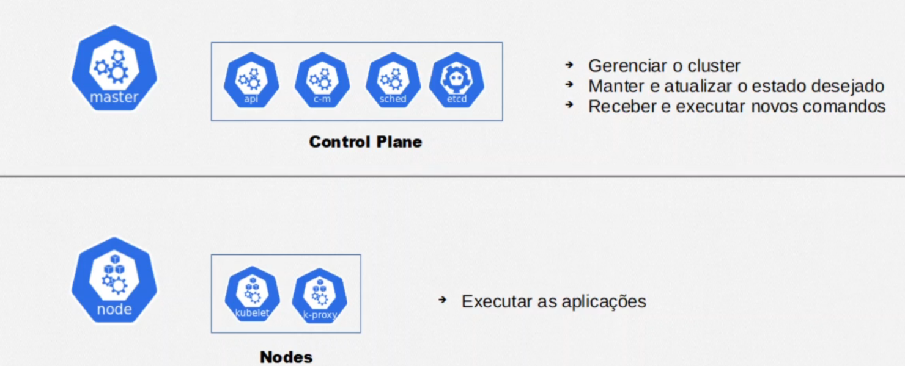
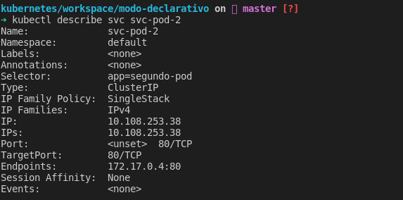

# Curso Kubernetes

---

# Entendendo


## Cluster 

> Um cluster é composto por:

- plano de controle - gerencia os serviços dentro do host.
- scheduler - Resp. por subir e os serviços.
- API Server - resp pela comunicação ente nós e master.
- Node Controller - Resp. por manter o estado dentro do cluster store.
- Cluster store (etcd) - Armazenamentos do dados do cluster.


- Exemplo de um Cluster


- Master e nodes



- Estrutura


### API
- Gerencia os recursos do cluster (criar pod, deletera Replica Set, criar volume ..)
- Para usar manipular os recusos do kuberntes, sempre vamos usar a api
- Para usar a api usamos o kubctl.


### Pods

- Capsula que pode conter 1 ou mais containers.
- Sempre que se cria um pod temos um endereço ip para aquele pod, e como um pod pode ter varios container.
- Nesse caso não podemos ter mais dois container com a mesma porta dentro de um pod.


- Caso um pode falhe (ou seja todos os container estejam falhados), o kubernetes vai matá-lo e substituí-lo por outro, e não temos controle que qual ip sera atribuido a esse novo pod.


---

# Rolando kubernets local

> Para rodar o kubernets localmente, usamos o minikube, para baixa-lo acesse:
>
> link: https://minikube.sigs.k8s.io/docs/start/


## Instalação no Linux

```shell
## Minikube
## link: https://minikube.sigs.k8s.io/docs/start/

### Install
curl -LO https://storage.googleapis.com/minikube/releases/latest/minikube-linux-amd64
sudo install minikube-linux-amd64 /usr/local/bin/minikube

### Start
minikube start

### Use
minikube kubectl -- get nodes

### Create alias dentro do .bashrc
alias kubectl="minikube kubectl --"

### Dasboard
minikube dashboard
```


---

## Comandos uteis

> Segue alguns comandos uteis usados 


```shell
# Recuperas os nodes criados
kubectl get nodes

# Listar pods 
kubectl get pods

# listar pods com detalhes
kubctl get pods -o wide

# Acompanhar status pod 
kubectl get pods --watch


# Criar novo pod
kubectl run <nome-pode> --image=<imagem>:<versão>
# - ex:
kubectl run nginx-pod --image=nginx:latest

# Descrever informações do pod
kubectl describe <nome-pode>
# - ex
kubectl describe pod nginx-pod

# Editar pod
kubectl edit pod <nome-pod>
kubectl edit pod nginx-pod

# deletar pod
kubectl delete pod <noime-pod>
kubectl delete pod  nginx-pod
# deletar todos os pods
kubectl delete pods --all


# Entra no container com o modo interativo
kubectl exec -it <pod> -- bash

# Para sair do container em uso
crtl + D
```


---

# Criando recurso de forma declarativa

---

## Criando pods

>  Para criar pods de forma declarativa, primerio crie um arquivo usando a extenção .yaml

- Semelhante o abaixo

````yaml
apiVersion: v1  # define a versão da api do kubernetes
kind: pod       # define o tipo de recurso criado 
metadata:       # Meta dados que podesm ser adicionado ao pod
  name: uni-pod  # nome do pod
  labels:
    app: segundo-pod
spec:               # epecificação do pod
  containers:       # containers que compoe o pod
    - name: uni-nginx-container   # nome do container
      image: nginx:latest         # imagem usada para criar o container
    - name: uni-http-container
      image: httpd:alpine
    - name: db-noticias-container
      image: aluracursos/mysql-db:1
      env:
        - name: "MYSQL_ROOT_PASSWORD"
          value: "root"
        - name: "MYSQL_DATABASE"
          value: "test_db"
        - name: "MYSQL_USER"
          value: "user"
       ports: 
         - containerPort: 3306
````

- Comandos

````shell
# criado container
kubectl apply -f <nome-doa-arquivo>.yaml

# delete com arquivo deployment
kubctl delete -f <file>
````

---

## Criando seviços (svc)

> São abstrações para expor aplicações executando em um ou mais pods, que podem prover ips's fixos para comunicação, alem de DNS e balanciamento de carga.


Podem ser dos tipos:

- ClusterIP
- NodePort
- LoadBalancer

### Comandos


```shell
# Criando um novo servide
kubectl apply -f <file-do-svc>

# listando services criados
kubectl get services 
# ou
kubectl get svc

# ver os detalhes dos services
kubectl describe service <nome-do-svc>
# ou
kubectl describe svc <nome-do-serviço>

# Deletar serviços
kubectl delete svc <service--name>
# deletar todos os pods
kubectl delete svc --all
```


### Cluster de ips

> Serve para fazer a cominucação entre diferentes pods dentro de um mesmo cluster. Usa labels para redirecionar o tafrico para os pods.

**ex:**

```yml
apiVersion: v1
kind: Service
metadata:
  name: svc-pod-2
spec:
  type: ClusterIP
  selector:
    app: segundo-pod # seletor de pod
  ports:
  - port: 80  # portra entrada
    targetPort: 80 # porta para aonde vai en
```

> Neste exemplo, cria um cluster ip que gerarar um ip fixo para o pod com a seletor (label) **app: segundo-po**

- Para ver detalhes do service use:

```
# ver os detalhes dos services
kubectl get service <nome-do-svc>
kubectl describe service <nome-do-svc>
```

ex:





---

### NodePort

> Usado para permitir a comunicação com o mundo externo

```yaml
apiVersion: v1
kind: Service
metadata:
  name: svc-pod-1
spec:
  type: NodePort
  selector:
    app: primeiro-pod
  ports:
  - port: 80
    targetPort: 80 # porta do container / caso seja igual a port, não precisa informar
    nodePort: 30001 # porta de acesso externo tem que esta no range 30000 a 32767
```

- Para ver o ip para acesso dentro do node dê o comando:

```shell
# Mostra as configurações de forma extendida
kubeclt get svc -o wide
```

ex:


- Para acessar o pod usando o nodePort dentro do cluster use: 

  >  curl 10.106.182.107:80

- Para acessa externamente - linux

  - Se tiver no linux, para recuperar o im mapeado para o cluster

    ```shell
    kubectl get node -o wide
    ```

    ex:

    

    - Depois é so acessar http://192.168.49.2:30001/

    

- Para acessa externamente - windows

  > Use localhost:30001


---

### Loadbalance

> Nada mais é do que um NodePort que permite a distribuição do trafico entres os podes de um container.
>
> Ele é entregado com o serviço de Kuberbetes das nuvens, nele voce criar um arquivo e dis quais são os seletores e a partir dai o serviços de kubernets do provedor da nuvem gera um a instraestrutura de um loadbalance para que possamos acessa-los via web.
>
> - Por serem um Load Balancer, também são um NodePort e ClusterIP ao mesmo tempo.
> - Utilizam automaticamente os balanceadores de carga de cloud providers.


- Exemplo de arquivo

```yaml
apiVersion: v1
kind: Service
metadata:
  name: svc-lb-app-1
spec:
  type: LoadBalancer
  selector:
    app: primeiro-pod
  ports:
  - port: 20
    targetPort: 80
```

- Dentro do provedor para executar a use:

```shell
kubectl apply -f <nome-arquivo>
```

- Para ver o status use:

```
 kubectl get svc -o wide
 # ou
  kubectl describe svc <svc-name>
```


> Repare que o EXTERNAL-IP esta vazio, pois executamos localmente, se fosse num provedor, seria preenciado com um ip para acesso web, repare tambem que foi gerado uma porta para acesso externo dentro da rede onde o cluster esta, semelhante ao NodePort.


----

## ConfigMap

> Permite extrair as configuração expecificas para tornar um pod generico e reutilizavel, com ele é possivel reutilizar configurações e varis pods

```yaml
apiVersion: v1
kind: ConfigMap
metadata:
  name: db-config-map
data:
  MYSQL_ROOT_PASSWORD: root
  MYSQL_DATABASE: test_db
  MYSQL_USER: user
  MYSQL_PASSWORD: pass	
```

- Para implatar use

```shell
kubectl apply -f <nome-arquivo>
```

- Para listar o configmap use:

```shel
kubectl get configmap
```

ex:


- Para descrever o configmap use:

  ```shell
  kubectl describe configmap <nome-config-map>
  ```

ex:


---

### Importando o configMap  na definição de um pod

Há duas dorma de se fazer a importação

#### Por variaveis

> Mais verboso, e util quando se tem varios configMaps compartilhado

```yaml
apiVersion: v1
kind: Pod
metadata:
  name: db-noticias
  labels:
    app: db-noticias
spec:
  containers:
  - name: db-noticias-container
    image: aluracursos/mysql-db:1
    env:
      - name: "MYSQL_ROOT_PASSWORD"
        valueFrom:
          configMapKeyRef:
            name: db-config-map
            key: MYSQL_ROOT_PASSWORD
      - name: "MYSQL_DATABASE"        
        valueFrom:
          configMapKeyRef:
            name: db-config-map
            key: MYSQL_DATABASE
      - name: "MYSQL_USER"        
        valueFrom:
          configMapKeyRef:
            name: db-config-map
            key: MYSQL_USER
      - name: "MYSQL_PASSWORD"        
        valueFrom:
          configMapKeyRef:
            name: db-config-map
            key: MYSQL_PASSWORD
    resources:
      limits:
        memory: "128Mi"
        cpu: "500m"
    ports: 
      - containerPort: 3306	
```

ex:


#### Pelo arquivo completo

> Menos verboso, usado quando o config map tem a maioria ou todas a variaveis (configurações) que o pod ira usar

```yaml
apiVersion: v1
kind: Pod
metadata:
  name: db-noticias
  labels:
    app: db-noticias
spec:
  containers:
  - name: db-noticias-container
    image: aluracursos/mysql-db:1
    envFrom:
      - configMapRef:
          name: db-config-map            
    resources:
      limits:
        memory: "128Mi"
        cpu: "500m"
    ports: 
      - containerPort: 3306
```


ex: 


---

# Recursos do kubernetes

> Arquivos de exemplo dentro da pasta workspace/projeto-avançado

- Tipos de recuros que vamos ver:

> - ReplicasSets
> - Deployments


----

## ReplicaSet


> Estrutura que pode encapsular um ou mais pods, usada quando se quer manter alta disponibilidade, pois se um pod cair o replicaSet sobe outro automaticamente.

```yaml
apiVersion: apps/v1
kind: ReplicaSet
metadata:
  name: portal-noticias-replicaset
spec:
  template: # template a ser usado pelo replicaset
    metadata:
      name: portal-noticias
      labels: 
        app: portal-noticias # label usada para identificar os pods
    spec:
      containers:
        - name: portal-noticias-container
          image: aluracursos/portal-noticias:1
          ports:
            - containerPort: 80
          envFrom:
            - configMapRef:
                name: portal-configmap
  replicas: 3 # numeros de replicas que deve existir
  selector: # serve pra dizer o kubernetes que ele deve gerenciar os pods com essa label
    matchLabels:
      app: portal-noticias 
```

- Como definidos tres replicas, ao se verificar os pods veremos:


> caso delete algum pod do replicaSet ele automaticamente recriará um novo.

- Para ver os replicasSets criado os o comando:

```shell
kubectl get replicasset
kubectl get rs
# ou se quiser mais detalhes
kubectl describe replicaset <nome>
kubectl describe rs <nome>
```


---

## Deployments


```yaml
apiVersion: apps/v1
kind: Deployment
metadata:
  name: nginx-deployment
spec:
  replicas: 3
  selector:
    matchLabels:
      app: nginx-pod  # deve ser igual ao labels do metadata do template
  template:
    metadata:
      labels:
        app: nginx-pod 
    spec:
      containers:
      - name: nginx-container
        image: nginx:stable
        resources:
          limits:
            memory: "128Mi"
            cpu: "500m"
        ports:
        - containerPort: 80
```


- Ao executar, será criado um replicaset com tres pods, semelhante ao visto anteriores:

```shell
kubectl apply -f <nome-arquivo>	
```

ex:


- Para listar e ver detalhes do deplyment use:

```shell
kubectl get deployments
# ou, caso queira mais detalhes use
kubectl describe deployments <nome>
```


> A diferencia que o deployment, permite adicionar outros recurso em um só arquivo, alem de ter uns comandos para controle de versionamento.


### Comandos

```shell
# Aplicar deployment
kubectl apply -f <nome-arquivo>	

# Deletar deployment (deleta todos o recursos atrelados)
kubectl delete deployment <nome do deployment>
kubectl delete -f <nome-arquivo->
# ou 

# Ver deployments
kubectl get deployments

# ou, caso queira mais detalhes use
kubectl describe deployments <nome>

# ver historico
kubectl rollout history deployment <nome-do-deployment>

# voltar pra uma versão
kubectl rollout undo deployment <nome-do-deploy> --to-revision=2
```


### Historico de versões

> - Historico de alterações - mostra o historico de alerações
>
> ```shell
> kubectl rollout history deployment <nome-do-deployment>
> ```
>
> 
>
> **obs:** Deve ser passadoa  flag --record no final do comando de **apply**
>
> ```shell
> kubectl apply -f <arquivo-deployment> --record
> ```
>
> 
>
> - Altera mensagem de alteração
>
> Quando fazemos o passo anterior, e vemos o historico, so vemos a linha do deplyment onde ouver a alteração, caso queiramos adicionar uma mensagem, mais amigavel, podemos após o **apply** dar o comando abaixo:
>
> ```shell
> kubectl annotate deployment <nome-do-deploy> kubernetes.io/change-cause="Messagem que equeremos"
> ```
>
> ### 

### Voltando uma versão (rollback)

>Realizando o passo anterior podemos voltar versões, (fazer um rollback) com o comando:
>
>```shell
>kubectl rollout undo deployment <nome-do-deploy> --to-revision=2
>```
>
>
